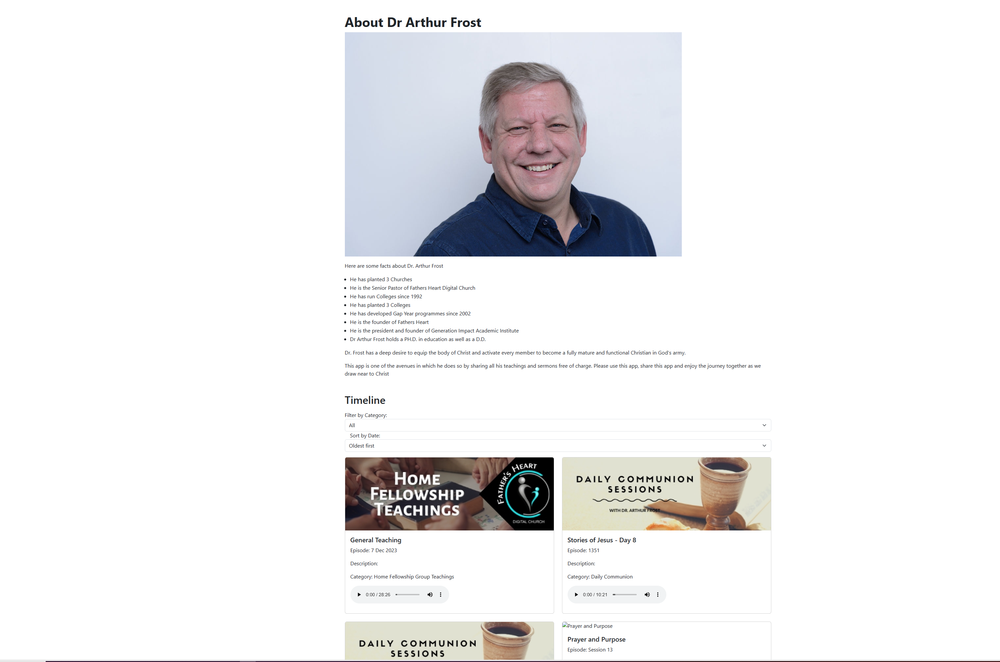

# Arthur Frost Application

This is a single-page React application that displays a timeline with content retrieved via an Ajax call to [https://arthurfrost.qflo.co.za/php/getTimeline.php](https://arthurfrost.qflo.co.za/php/getTimeline.php).

## Table of Contents

- [Introduction](#introduction)
- [Features](#features)
- [Installation](#installation)
- [Usage](#usage)
- [Dependencies](#dependencies)
- [Screenshots](#screenshots)
- [Contributing](#contributing)
- [License](#license)

## Introduction

The application uses React to create a single page that displays the contents of a JSON content retrieved via an Ajax call. The timeline includes media functionality to listen to audio and view images. The visual appearance is enhanced using Bootstrap 5.

## Features

- Display timeline items with images, titles, and descriptions.
- Play audio associated with each timeline item.
- Filter timeline items by category.
- Sort timeline items by date.

## Installation

1. **Clone the repository:**

   ```bash
   git clone https://github.com/your-username/react-timeline-app.git

2. **Change into the project directory:**
   ```bash
   cd arthur-frost

3. **Install dependencies:**
   ```bash
   npm install

4. **Start the development server:**
   ```bash
   npm start


5. **Open your browser and navigate to [http://localhost:3000](http://localhost:3000).```

## Dependencies

- React
- Bootstrap 5
- Axios

## Screenshots



## Contributing

If you'd like to contribute to this project, please follow these guidelines...

## License

This project is licensed under the MIT License - see the [LICENSE.md](LICENSE.md) file for details.